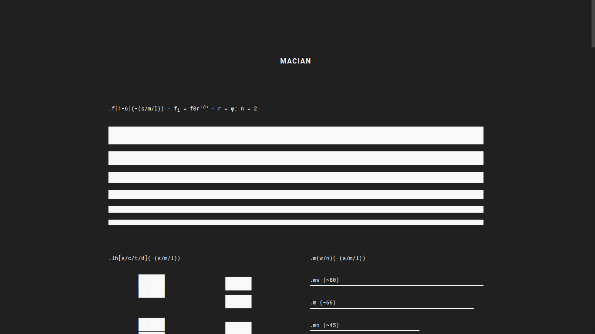

[](https://joshavanier.github.io/macian/)


**Macian** is a [Tachyons](https://tachyons.io/)-inspired CSS framework. My goal with Macian is to create a lightweight yet versatile CSS framework to simplify the process of creating things for the web and to unify my creations under a set of standards.

#### Features
+ Mobile-first architecture
+ Golden ditonic typographic scale
+ Tachyons-inspired utility classes

#### Codex
The Codex is a visual documentation of Macian's components. Take a look at it over [here](https://joshavanier.github.io/macian/)

#### Usage
```html
<link rel="stylesheet" href="https://unpkg.com/macian/macian.min.css">
```

---

Josh Avanier

[](https://twitter.com/joshavanier) [](https://joshavanier.github.io)
